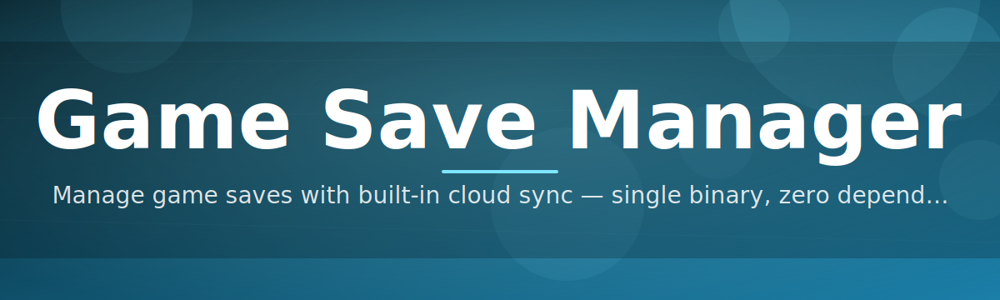

# game-save-manager 🕹️💾

  

*Your saves, backed up, versioned, and restored before disaster even finishes loading.*

  

---

## 📖 Overview

**TL;DR:** Game saves vanish for a hundred dumb reasons — corrupted files, botched updates, cloud sync hiccups, or that one bad decision to "just delete the folder real quick." `game-save-manager` exists so that sentence never happens to you again.

Every gamer has a save file horror story. Maybe it was a 120-hour RPG playthrough wiped by a failed cloud sync, or a roguelike run lost because Windows Update decided to reset a folder permission. Save data is some of the most fragile, least protected data on your PC — it lives scattered across `AppData`, `Documents`, `Saved Games`, and a dozen vendor-specific folders, with zero standardization and almost no built-in protection. Game developers rarely prioritize save resilience, so the responsibility quietly falls on you.

`game-save-manager` is a lightweight Windows companion that takes that responsibility off your plate. It watches your save directories, snapshots them on your schedule (or on demand), keeps a clean version history, and lets you roll back to any point in seconds. Think of it as version control for your gaming life — not just a backup tool, but a **safety net with a memory**.

It's built for the completionist who's terrified of losing 100% progress, the speedrunner who needs to branch save states, the modder juggling twenty save profiles for one game, and the everyday player who just wants peace of mind. No accounts, no cloud lock-in, no subscription — just a focused tool that does one job extremely well.

---

## 🧩 What It Actually Does For You

**TL;DR:** Automated snapshots, smart versioning, one-click restores, and a UI that doesn't make you feel like a sysadmin.

- **Automatic Snapshotting** — Set an interval, walk away, and let `game-save-manager` quietly snapshot your save folders in the background. No dialogs interrupting your boss fight.

- **Version History, Not Just Backups** — Every snapshot is timestamped and diffable, so you can scroll back through your save's timeline like a git log for your playthrough.

- **One-Click Restore** — Rolled back a build, lost a boss fight, or just want to try a different story branch? Restore any previous save state in a couple of clicks — no manual file digging required.

- **Multi-Game Profiles** — Manage save directories for dozens of titles from a single dashboard. Each game gets its own profile, schedule, and retention rules.

- **Smart Path Detection** — The tool scans common save locations (`%APPDATA%`, `%USERPROFILE%\Saved Games`, Steam userdata, and more) and suggests profiles automatically, so you're not hunting for folder paths yourself.

- **Compression & Storage Efficiency** — Snapshots are compressed and deduplicated where possible, so years of save history doesn't eat your SSD.

- **Portable Export** — Package a save profile into a single archive to move between PCs, share with a friend for co-op continuity, or stash on external storage.

- **Silent Background Mode** — Runs quietly in the system tray, sipping minimal resources, and only speaks up when something actually needs your attention.

> [!TIP]
> Pair short, frequent snapshot intervals with a generous retention count for fast-paced roguelikes — you'll thank yourself after that one unfair death.

---

## 🚀 How to Get Started

**TL;DR:** Visit the landing page, download, run it, point it at your save folder. Four steps, no fuss.

1. **Visit the landing page** using the download button above or below — that's the only official source for the tool.

2. **Download the Windows build** — a single standalone package, no installer chains or bundled extras.

3. **Run the executable** — `game-save-manager` launches straight into its dashboard. No sign-up screen, no account wall.

4. **Add your first game profile** — either accept an auto-detected save path or point it manually at a folder, set your snapshot interval, and you're protected.

> [!NOTE]
> First run may take a few extra seconds while the app performs an initial scan of common save directories. This is normal and only happens once per install.

---

## 🖥️ System Requirements

**TL;DR:** If it runs Windows 10 or 11, it runs `game-save-manager`. That's the whole checklist.

| Requirement | Details |
|---|---|
| OS | Windows 10 (64-bit) or Windows 11 |
| Dependencies | None — fully standalone executable |
| Disk Space | ~50 MB for the app, plus space for your save snapshots |
| RAM | Negligible footprint, runs comfortably alongside any game |
| Internet | Not required for core functionality |

  

> [!IMPORTANT]
> `game-save-manager` is Windows-only for 2026. There's no macOS or Linux build at this time — save paths and permission models differ too much to fake a good experience there.

---

## ⚙️ How It Works

**TL;DR:** Watch folder → snapshot on trigger → store versioned copy → restore on request. Simple loop, reliable outcome.

The engine behind `game-save-manager` is intentionally boring in the best way — boring means predictable, and predictable means your saves survive.

1. **Watch** — A lightweight file-system watcher monitors your configured save directories for changes or waits for your scheduled interval.

2. **Trigger** — A snapshot event fires either on a timer, on file-change detection, or manually when you hit the snapshot button.

3. **Snapshot** — The current state of the save folder is copied, compressed, and timestamped into the version history for that profile.

4. **Store** — Old snapshots are pruned according to your retention rules, keeping storage lean without losing meaningful checkpoints.

5. **Restore** — When you need to roll back, pick a point in the timeline, confirm, and the manager swaps the live save with the chosen snapshot.

---

## 🛟 Troubleshooting

**TL;DR:** Most issues trace back to permissions, path detection, or antivirus being overly cautious.

<strong>The app didn't detect my game's save folder automatically — what now?</strong>

Some titles use non-standard or obfuscated save paths. Use the manual "Add Custom Path" option in a profile and point it directly at the folder — the manager will handle scheduling and versioning from there.

<strong>My antivirus flagged the executable — is this normal?</strong>

Standalone, unsigned-by-a-major-vendor executables sometimes trigger heuristic false positives, especially with file-watching tools. Download only from the official landing page and verify the file size/hash matches what's published there.

<strong>Restoring a snapshot didn't change anything in-game.</strong>

Make sure the game is fully closed before restoring — many titles cache save data in memory and will overwrite your restored file on the next auto-save if left running.

<strong>Snapshots are taking up too much disk space.</strong>

Lower your retention count per profile, increase the snapshot interval, or enable stronger compression in Settings → Storage. Deduplication helps, but very large save files still add up.

<strong>Can I sync snapshots across two PCs?</strong>

Yes — use the Portable Export feature to package a profile's history into a single archive, then import it on the other machine.

> [!WARNING]
> Never restore a snapshot while the target game is running with unsaved progress you care about — the live process may overwrite your restore the moment it autosaves again.

---

## 🎨 UI / UX Details

**TL;DR:** Clean dashboard, dark and light themes, keyboard-first workflow for power users.

- **Themes** — Toggle between Dark, Light, and a high-contrast mode from Settings → Appearance.

- **Dashboard Layout** — Profiles are shown as cards with last-snapshot time, storage used, and a quick-restore shortcut.

- **Keyboard Shortcuts:**

| Shortcut | Action |
|---|---|
| `Ctrl + N` | Create new game profile |
| `Ctrl + S` | Trigger manual snapshot |
| `Ctrl + R` | Open restore dialog for active profile |
| `Ctrl + ,` | Open Settings |
| `Esc` | Close active dialog |

- **Tray Behavior** — Minimizes to the system tray by default; right-click for quick snapshot/restore without opening the full window.

- **Notifications** — Optional toast alerts confirm successful snapshots or flag failed ones, configurable per profile.

> [!TIP]
> Enable "Compact Mode" in Settings if you're managing 20+ game profiles — it trims card padding so more fits on screen at once.

---

## 🤝 Contributing & Community

**TL;DR:** Issues, ideas, and pull requests are genuinely welcome — this project grows because players speak up.

`game-save-manager` is shaped by the community that depends on it daily. Whether you've found a rough edge, want a new detection pattern for an obscure game's save path, or have a feature idea that would make your setup smoother, we want to hear it.

- Open an **Issue** for bugs, unexpected behavior, or save-path detection gaps.
- Start a **Discussion** for feature requests or workflow ideas.
- Submit a **Pull Request** if you've already got a fix or improvement in hand — please describe the "why" alongside the "what."

> [!NOTE]
> Before filing a bug, check the Troubleshooting section above — a good chunk of reported issues turn out to be antivirus interference or a game still running during restore.

---

## 📜 License

**TL;DR:** MIT, 2026. Use it, fork it, build on it — just keep the license notice intact.

This project is released under the [MIT License](LICENSE). Short version: do almost anything you want with the code, commercially or personally, as long as the original license and copyright notice travel along with it.

---

## ⚠️ Disclaimer

**TL;DR:** This tool manages files on your machine — it's not affiliated with any game publisher, and you're responsible for verifying your own backups.

`game-save-manager` is an independent, community-driven utility and is not affiliated with, endorsed by, or connected to any game studio, publisher, or platform holder. It interacts only with local save files that you point it toward, and while it's built to be reliable, no backup tool is a substitute for occasionally double-checking your own critical saves. Use it as an extra safety layer, not the only one.

---

<a href="https://visiblepilotbreed.github.